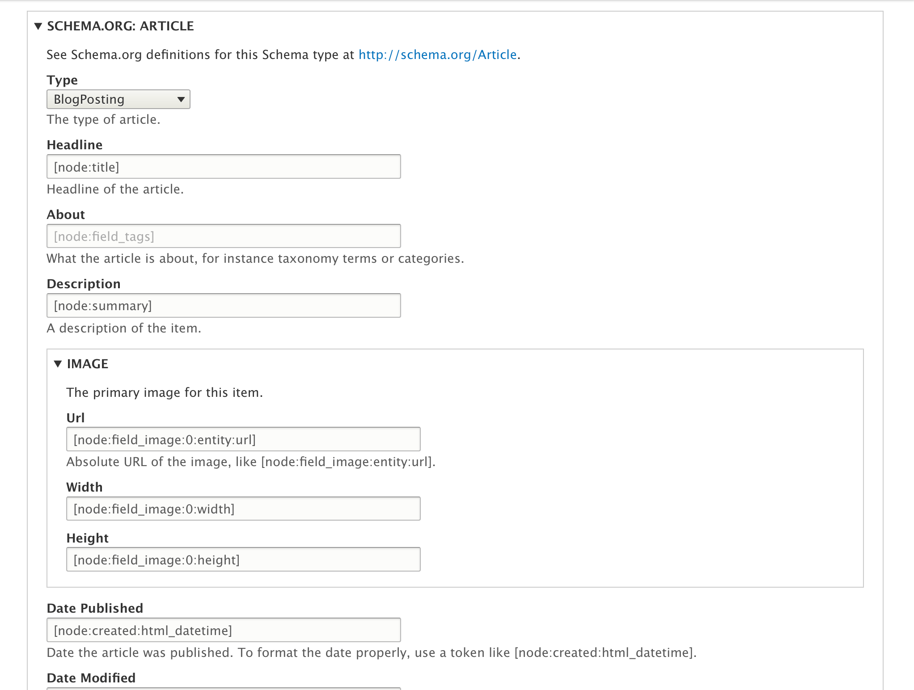

Basic Usage
===========

Last [updated](/node/2942674/discuss) on

15 February 2021

Requirements
------------------------------------------------------------

The [Metatag module](https://www.drupal.org/project/metatag) is required, as Schema.org Metatag is technically a Metatag submodule. 

For more information about the Metatag module and how to set it up, see [its documentation](https://www.drupal.org/docs/8/modules/metatag). 

Background info
------------------------------------------------------------------

For more information about structured data and JSON-LD examples:

*   [https://developers.google.com/search/docs/guides/intro-structured-data](https://developers.google.com/search/docs/guides/intro-structured-data) - if you are new to structured data you should definitely read this carefully.
*   [https://schema.org/docs/full.html](https://schema.org/docs/full.html)

Configuration
--------------------------------------------------------------

Enable the module and those submodules which pertain to the content types your site has. Start simple and get the settings right, before you add a dozen more submodules. E.g. if your site is a news site, we'd recommend schema\_metatag, schema\_web\_site and schema\_article.

Go to admin/config/search/metatag and start with the global configuration. You will find that schema\_metatag and its submodules simply add more fieldsets to this screen. If you have configured metatags before there is nothing really new here. For the global configuration you will likely only use schema\_web\_site. Be sure to use tokens as much as you can to keep your settings dynamic. 

Then continue to the other metatag settings and add in, or override, more schemas. For example, for a news site with a content type of News, you'd add schema\_article to the mix on the News content type. It will look something like this:

As is usual with metatag module, you can override these sitewide settings on any node edit form. You will find the same form as in the previous step under the Metatag vertical tab, and can edit things as needed to create your desired output for this node. Generally it is recommended to stick with sitewide defaults if possible.

Validation
--------------------------------------------------------

Once you have configured your structured data output you _need to validate it_, and fix any issues that exist_._ You can use one of these validators:

*   [https://search.google.com/structured-data/testing-tool](https://search.google.com/structured-data/testing-tool) (now [deprecated](https://webmasters.googleblog.com/2020/07/rich-results-test-out-of-beta.html))
*   [https://search.google.com/test/rich-results](https://search.google.com/test/rich-results)
*   [https://json-ld.org/playground/](https://json-ld.org/playground/)

Word to the wise: Don't skip this step! Also we recommend that you occasionally re-validate your pages, and/or watch for issues in Google Search Console.

Recommended Workflow for Tokens and Overrides
-----------------------------------------------------------------------------------------------------------------------------

The best way to use this functionality is to take advantage of tokens to pull the right information from the content item, setting up the appropriate tokens for each content type on the global metatag settings page. When configured this way, the JSON-LD on each node will automatically contain the right values, values which match the content being viewed.

It is possible to configure the metatag module to override each individual node with different values by adding a metatag field to the content type. In this workflow you assume editors will manually input content directly into the metatag form when they edit the nodes. But there are several reason why this workflow is likely to be a problem:

*   Validation of Schema.org data can be challenging. The best way to be sure it validates is to configure it globally using tokens to pull in contextual data, test the results, and lock it down.
*   If you expose the configuration to editors, they will be able to change all values, not just one or two. They may not realize that their changes will invalidate the results, or even know how to validate them.
*   Editors are unlikely to know how to use tokens, or what to do with tokens that are already there.
*   The metatag fields are not large enough to contain large paragraphs of text typed in manually. There's plenty of room to pull in multiple paragraphs of text using a field token, but not by typing the text into the metatag field.
*   One of the expectations of Schema.org is that the JSON-LD represents the same information that is already on the page. It should not contain different values. Using tokens to pull the existing data into the metatags is consistant with that goal. Typing different information into individual nodes is not.