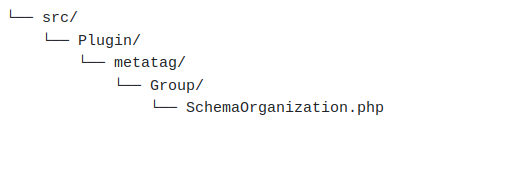

# Developer Instructions for 8.2 Branch

Last [updated](/node/3170637/discuss) on 29 February 2024

Extending an existing schema
--------------------------------------------------------------------------------------------

Schema.org Metatag module contains an example module, schema\_article\_example, that shows how the Article schema can be extended without altering the schema\_article module itself. Using this as a template basically only entails file name changes, and naming edits in the code. This is a great option if the extension is for an arcane property, or proprietary to you.  It is also useful since future module updates won't overwrite your code.

Alternatively, you can extend one of the existing submodules. We recommend you check out the current development branch via git for this. Then post [your patch](https://www.drupal.org/node/707484) to the [issue queue](https://www.drupal.org/project/issues/schema_metatag) for inclusion into the module. This is your best option if the extension is of broad value to most folks, such as adding a property required or recommended by search engines.

Adding support for a new schema
--------------------------------------------------------------------------------------------------

For a completely new schema, let's use the Service schema as an example. A review of [schema.org/Service](https://schema.org/Service) shows that Service has many of the same properties as Product. So as a decent first cut we will clone the schema\_product module. Use an analogous approach for any other schemas.

1.  Copy the schema\_product directory and name it schema\_service. Rename each file in schema\_service to contain _service_ in its name instead of _product_.
2.  Go through all code files and change _product_ to _service_. You will find lowercase and uppercase instances, change them all and retain case.
3.  You may want to edit description text for certain types. Generally these should match what you find at schema.org, but you can often do better by being more precise.
4.  Clear Drupal cache, and enable your new module. If none is found you haven't completed your renaming.
5.  Go to /admin/config/metatag and check whether your new schema shows up, and then check whether all fields show up correctly and are free of typos.
6.  The only tricky part of this process is finding the right property type to use for each property. Go to [Schema.org/Service](https://schema.org/Service) to see all the properties that could be used. You'll see each property has an "Expected Type" (see illustration below). Many of those property types map to property types provided by this module.
7.  For each property, create/edit a Tag plugin that extends SchemaNameBase and populate the annotation with relevant information for the selected property type. See below for more details about what goes in the tag annotation.
8.  Each property should also be listed in **/config/schema/schema\_service.metatag\_tag.schema**. These values are only used by tests, but tests won't pass if you leave them out.
9.  Test your submodule on a node or sitewide by filling in values or tokens, and check the output on a relevant node.
10.  Run the JSON-LD code through Google's validator at [https://search.google.com/test/rich-results](https://search.google.com/test/rich-results).
11.  [Create a patch](https://www.drupal.org/node/707484) from your code and post it into a new issue in [Schema.org Metatag's issue queue](https://www.drupal.org/project/issues/schema_metatag).

Creating a new group for the new schema
------------------------------------------------------------------------------------------------------------------

For a new schema, a new group is to be created for the distinction between other schema types.  
To create a new group follow the steps below:

*   Create folder structure as src/Plugin/metatag/Group/GroupName.php
    
    
    
*   For example, we have taken SchemaOrganization.php as a file to declare the schema group and schema\_organization as the module name.
*   SchemaOrganization.php or any group file extends the Drupal\\schema\_metatag\\Plugin\\metatag\\Group\\SchemaGroupBase class.
*   In the SchemaOrganization.php we have to declare the id, label, description, and weight of the group.  
    
        <?php
        
        namespace Drupal\schema_organization\Plugin\metatag\Group;
        
        use Drupal\schema_metatag\Plugin\metatag\Group\SchemaGroupBase;
        
        /**
         * Provides a plugin for the 'Organization' meta tag group.
         *
         * @MetatagGroup(
         *   id = "schema_organization",
         *   label = @Translation("Schema.org: Organization"),
         *   description = @Translation("See Schema.org definitions for this Schema type at <a href="":url"">:url</a>. Also see <a href="":url2"">Google's requirements</a>.", arguments = {
         *     ":url" = "https://schema.org/Organization",
         *     ":url2" = "https://developers.google.com/search/docs/data-types/local-business",
         *   }),
         *   weight = 10,
         * )
         */
        class SchemaOrganization extends SchemaGroupBase {
          // Nothing here yet. Just a placeholder class for a plugin.
        }
        
    
    This will create a new group for the new submodule.
    

Available Property Types
------------------------------------------------------------------------------------

The list of available property types changes from time to time, but the initial list is below. Look in the **/src/Plugin/schema\_metatag/PropertyType** directory of your repository to see the complete list. This list shows you the Schema.org name and the plugin id.

*   Action (action)
*   AggregateRating (aggregate\_rating)
*   Answer (answer)
*   Book (book)
*   Boolean (boolean)
*   Brand (brand)
*   BreadcrumbList (breadcrumb\_list)
*   Clip (clip)
*   ContactPoint (contact\_point)
*   Country (country)
*   CreativeWork (creative\_work)
*   CreativeWorkSeason (creative\_work\_season)
*   Date (date)
*   DateTime (date\_time)
*   Duration (duration)
*   EntryPoint (entry\_point)
*   Event (event)
*   GeoCoordinates (geo\_coordinates)
*   GovernmentService (government\_service)
*   HowToStep (how\_to\_step)
*   ImageObject (image\_object)
*   ItemListElement (item\_list\_element)
*   Mass (mass)
*   MonetaryAmount (monetary\_amount)
*   Number (number)
*   NutritionInformation (nutrition\_information)
*   Offer (offer)
*   OpeningHoursSpecification (opening\_hours\_specification)
*   Organization (organization)
*   Person (person)
*   Place (place)
*   PostalAddress (postal\_address)
*   ProgramMembership (program\_membership)
*   QuantitativeValue (quantitative\_value)
*   Question (question)
*   Rating (rating)
*   Review (review)
*   SpeakableSpecification (speakable\_specification)
*   Text (text)
*   Thing (thing)
*   Type (type)
*   URL (url)
*   WebPageElement (web\_page\_element)

Tag Annotation
----------------------------------------------------------------

As an example, on [Schema.org/Article](http://schema.org/Article) there is an **author** property that should be either a **Schema.org/Person** object or a **Schema.org/Organization object**. You would set up the **author** tag to extend SchemaNameBase and use the **organization** property type (which is general enough to work for either **Person** or **Organization** types), and use **tree\_parent** to indicate that you want both **Person** and **Organization** to appear as **@type** options. The tag and its annotation looks like the following:

    <?php
    namespace Drupal\schema_article\Plugin\metatag\Tag;
    
    use Drupal\schema_metatag\Plugin\metatag\Tag\SchemaNameBase;
    
    /**
     * Provides a plugin for the 'author' meta tag.
     *
     * @MetatagTag(
     *   id = "schema_article_author",
     *   label = @Translation("author"),
     *   description = @Translation("REQUIRED BY GOOGLE. Author of the article."),
     *   name = "author",
     *   group = "schema_article",
     *   weight = 5,
     *   type = "string",
     *   secure = FALSE,
     *   multiple = TRUE,
     *   property_type = "organization",
     *   tree_parent = {
     *     "Person",
     *     "Organization",
     *   },
     *   tree_depth = 0,
     * )
     */
    class SchemaArticleAuthor extends SchemaNameBase {
    
    }
    ?>

Note that all information is in the annotation, nothing else needs to be provided in the tag. We are adding three properties that Metatag doesn't use or care about:

*   **property\_type**: The id of the Schema Metatag property type plugin that applies to this tag.
*   **tree\_parent**: The top level Schema.org types that should appear as options for the @type property, only necessary for complex property types that have sub-properties of their own, not used for simple properties like **Text** that just create a simple textfield. For instance, you could create a property type of **organization** but use tree\_parent to indicate that you only want to display the organization types starting with **LocalOrganization**.
*   **tree\_depth**: How deep to go below those top level types. Zero (0) means just display the named item, -1 means display any other items nested below it, 1 means go down one level, 2 means go down two levels, etc. Not used for simple property types.

If the above information is omitted, you'll get a **Text** property, the default.

Property Type Annotation
------------------------------------------------------------------------------------

You won't need to do anything with property types unless you want to alter them or create new ones, but property types also encompass all information in their annotations. For instance, this is the **Place** property type:

    <?php
    
    namespace Drupal\schema_metatag\Plugin\schema_metatag\PropertyType;
    
    use Drupal\schema_metatag\Plugin\schema_metatag\PropertyTypeBase;
    
    /**
     * Provides a plugin for the 'Place' Schema.org property type.
     *
     * @SchemaPropertyType(
     *   id = "place",
     *   label = @Translation("Place"),
     *   tree_parent = {
     *     "Place",
     *   },
     *   tree_depth = 2,
     *   property_type = "Place",
     *   sub_properties = {
     *     "@type" = {
     *       "id" = "type",
     *       "label" = @Translation("@type"),
     *       "description" = "",
     *     },
     *     "name" = {
     *       "id" = "text",
     *       "label" = @Translation("name"),
     *       "description" = @Translation("The name of the place."),
     *     },
     *     "url" = {
     *       "id" = "url",
     *       "label" = @Translation("url"),
     *       "description" = @Translation("The url of the place."),
     *     },
     *     "address" = {
     *       "id" = "postal_address",
     *       "label" = @Translation("address"),
     *       "description" = @Translation("The address of the place."),
     *       "tree_parent" = {
     *         "PostalAddress",
     *       },
     *       "tree_depth" = 0,
     *     },
     *     "geo" = {
     *       "id" = "geo_coordinates",
     *       "label" = @Translation("geo"),
     *       "description" = @Translation("The geo coordinates of the place."),
     *       "tree_parent" = {
     *         "GeoCoordinates",
     *       },
     *       "tree_depth" = 0,
     *     },
     *   },
     * )
     */
    class Place extends PropertyTypeBase {
    
    }
    ?>

Again, all the information is in the annotation.

*   **id**: The machine name of the property type.
*   **label**: The label, which should match the Schema.org property name.
*   **description**: A description to display in the form element that creates this property type.
*   **property\_type**: The name of the Schema.org property created by this property type.
*   **tree\_parent**: The top level Schema.org types that should appear as options for the @type property, only necessary for complex property types that have sub-properties of their own, not used for simple properties like **Text** that just create a simple textfield. It might be the same as the property type, but could also be some more specific type. For instance, you could create a property type for **Organization** but use tree\_parent to indicate that you only want to display the organization types starting with **LocalOrganization**.
*   **tree\_depth**: How deep to go below those top level types. Zero (0) means just display the named item, -1 means display any other items nested below it, 1 means go down one level, 2 means go down two levels, etc. Not used for simple property types.
*   **sub\_properties**: an array of every nested sub-property of this property type, where each item in the array contains the same information as is provided for the primary property.

Changing Tag and Property Type Behavior
------------------------------------------------------------------------------------------------------------------

Because all information for both Tags and Property Types are in their annotations, either or both can be changed using definition alter hooks. This wasn't true in the 8.1 version where many things are hard-coded in Traits, which can't easily be altered.

    /**
     * Adjust Schema Metatags tags.
     *
     * Use hook_metatag_tags_alter() to change tag information.
     *
     * Schema Metatag adds new information to the standard Metatag definition.
     * Use this hook to alter that information.
     *
     * @param array $definitions
     *   An array of the tag definitions.
     */
    function hook_metatag_tags_alter(&$definitions) {
      // Set up the Schema Service tags to only display "GovernmentService" in the
      // @type option list.
      $definitions['schema_service_type']['property_type'] = 'type';
      $definitions['schema_service_type']['tree_parent'] = ['GovernmentService'];
      $definitions['schema_service_type']['tree_depth'] = 0;
    
      // Set up the Schema Organization tags to display every "LocalBusiness" option
      // in the @type option list.
      $definitions['schema_organization_type']['property_type'] = 'type';
      $definitions['schema_organization_type']['tree_parent'] = ['LocalBusiness'];
      $definitions['schema_organization_type']['tree_depth'] = -1;
    
      // Use a different PropertyType plugin for Schema Recipe instructions, the
      // HowToStep instead of the Text type used by Schema Recipe. Make it a multiple
      // value too since there will be more than one step.
      $definitions['schema_recipe_recipe_instructions']['property_type'] = 'how_to_step';
      $definitions['schema_recipe_recipe_instructions']['tree_parent'] = ['HowToStep'];
      $definitions['schema_recipe_recipe_instructions']['tree_depth'] = -1;
      $definitions['schema_recipe_recipe_instructions']['multiple'] = TRUE;
    }
    
    /**
     * Adjust Schema Metatags property types.
     *
     * Use hook_schema_metatag_property_type_plugins_alter() to change property
     * type information. These changes will affect all properties that use these types.
     *
     * @param array $definitions
     *   An array of the property type definitions.
     */
    function hook_schema_metatag_property_type_plugins_alter(&$definitions) {
      // Change the Place property type to use plain text instead of the structured
      // PostalAddress and GeoCoordinates used as a default.
      $definitions['place']['property_type'] = 'Text';
      $definitions['place']['tree_parent'] = [];
      $definitions['place']['tree_depth'] = -1;
      $definitions['place']['sub_properties'] = [];
    
      // Update the CreativeWork property type to add an author sub-property to all
      // properties that use this property type.
      $definitions['creative_work']['sub_properties'] += [
        'author' => [
          'id' => 'person',
          'label' => t('author'),
          'description' => t('The person who created this.'),
          'tree_parent' => ['Person'],
          'tree_depth' => 0,
        ],
      ];
    
    }
    ?>

Updating from 8.1 to 8.2
----------------------------------------------------------------------------------

If you created custom tags in Schema.org Metatag version 8.1, you'll need to make some changes. In 8.1, you extended different classes depending on which type of property you wanted to create. In 8.2 you always extend SchemaNameBase and use the annotation to identify what type of property to create. Make changes like the following:

**SchemaActionBase**

Add to annotation:

     *   property_type = "action",
     *   tree_parent = {
     *     "ReadAction",
     *   },
     *   tree_depth = 0,

Extend SchemaNameBase instead of SchemaActionBase

**SchemaAddressBase**

Add to annotation:

     *   property_type = "postal_address",
     *   tree_parent = {
     *     "PostalAddress",
     *   },
     *   tree_depth = 0,

Extend SchemaNameBase instead of SchemaAddressBase

**SchemaAnswerBase**

Add to annotation:

     *   property_type = "answer",
     *   tree_parent = {
     *     "Answer",
     *   },
     *   tree_depth = 0,

Extend SchemaNameBase instead of SchemaAnswerBase

**SchemaBrandBase**

Add to annotation:

     *   property_type = "brand",
     *   tree_parent = {
     *     "Brand",
     *   },
     *   tree_depth = 0,

Extend SchemaNameBase instead of SchemaBrandBase

**SchemaContactPointBase**

Add to annotation:

     *   property_type = "contact_point",
     *   tree_parent = {
     *     "ContactPoint",
     *   },
     *   tree_depth = 0,

Extend SchemaNameBase instead of SchemaContactPointBase

**SchemaDateBase**

Add to annotation:

     *   property_type = "date",
     *   tree_parent = {},
     *   tree_depth = 0,

Extend SchemaNameBase instead of SchemaDateBase

**SchemaGeoBase**

Add to annotation:

     *   property_type = "geo_coordinates",
     *   tree_parent = {
     *     "GeoCoordinates",
     *   },
     *   tree_depth = 0,

Extend SchemaNameBase instead of SchemaGeoBase

**SchemaHasPartBase**

Add to annotation:

     *   property_type = "web_page_element",
     *   tree_parent = {
     *     "WebPageElement",
     *   },
     *   tree_depth = 0,

Extend SchemaNameBase instead of SchemaHasPartBase

**SchemaImageBase**

Add to annotation:

     *   property_type = "image_object",
     *   tree_parent = {
     *     "ImageObject",
     *   },
     *   tree_depth = 0,

Extend SchemaNameBase instead of SchemaImageBase

**SchemaItemListElementBase**

Add to annotation:

     *   property_type = "item_list_element",
     *   tree_parent = {
     *     "ItemListElement",
     *   },
     *   tree_depth = 0,

Extend SchemaNameBase instead of SchemaItemListElementBase

**SchemaItemListElementViewsBase**

Add to annotation:

     *   property_type = "item_list_element",
     *   tree_parent = {
     *     "ItemListElement",
     *   },
     *   tree_depth = 0,

Extend SchemaNameBase instead of SchemaItemListElementViewsBase

**SchemaItemListElementBreadcrumbBase**

Add to annotation:

     *   property_type = "breadcrumb_list",
     *   tree_parent = {
     *     "BreadcrumbList",
     *   },
     *   tree_depth = 0,

Extend SchemaNameBase instead of SchemaItemListElementBreadcrumbBase

**SchemaMainEntityOfPageBase**

Add to annotation:

     *   property_type = "url",
     *   tree_parent = {},
     *   tree_depth = 0,

Extend SchemaNameBase instead of SchemaMainEntityOfPageBase

**SchemaPersonOrgBase**

Add to annotation:

     *   property_type = "organization",
     *   tree_parent = {
     *     "Person",
     *     "Organization",
     *   },
     *   tree_depth = 0,

Extend SchemaNameBase instead of SchemaPersonOrgBase

**SchemaTrueFalseBase**

Add to annotation:

     *   property_type = "boolean",
     *   tree_parent = {},
     *   tree_depth = 0,

Extend SchemaNameBase instead of SchemaTrueFalseBase

**SchemaTypeBase**

Add to annotation (change tree\_parent value to match whatever type(s) are in labels()):

     *   property_type = "type",
     *   tree_parent = {
     *     "Organization",
     *   },
     *   tree_depth = -1,

Extend SchemaNameBase instead of SchemaTypeBase
