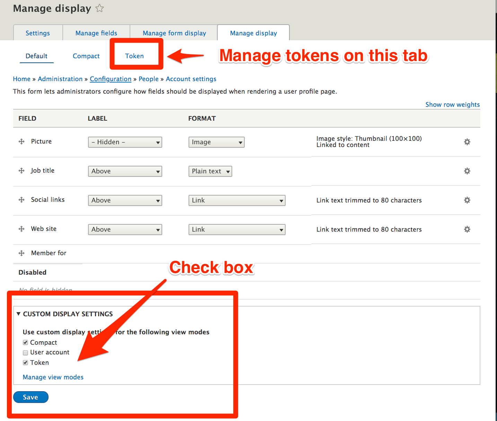
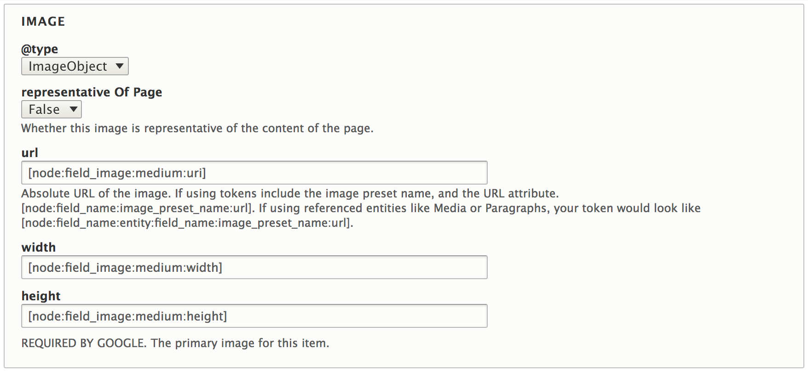
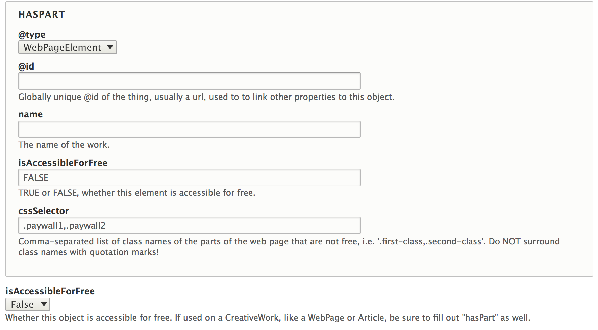

Help With Tokens and Fields
===========================

Last [updated](/node/2950932/discuss) on

26 May 2020

### Working with tokens

The key to getting the desired output often centers around finding the right tokens to use. Most tokens are a combination of the entity type and field, sometimes "chained" to drill into related content or to float a specific sub value to the top.

If you have trouble getting a token value that works, note that on the "Manage Display" tab of each content type you can select the types of displays you want to manage. One of those types is "Token". Check the box to expose the token display, and you can use that tab to control the way each field's token will look. Note that this controls the look of each field's token no matter where the token is used. So if you are also using tokens on Pathauto, for instance, be sure your changes work correctly in both places.

### ImageObjects

*   The image url should be an absolute url. If you use tokens this should mostly happen automatically.
*   If using tokens, you can include the image preset name, i.e. ​​​​​​**\[node:field\_name:image\_preset\_name:url\]**. Without the preset the original image will be used
*   Tokens can be used for the image dimensions, i.e. \[node:field\_image:medium:width\]. The dimensions will correspond with the preset you use in the token, or with the dimensions of the original image if no preset is used.
*   If using referenced entities like Media or Paragraphs, your image url token would look like **\[node:field\_media\_image:entity:field\_media\_image:large:url\].** This long token is broken down as follows:
    *   the original node
    *   the media/paragraph field name on that node
    *   entity (to say we now need to get values from the referenced media/paragraph entity)
    *   the image field name on the media/paragraph entity
    *   the image style or preset to use
    *   the image value (url, width, height, etc., all of which will be the correct values for the selected style)
    *   If the paragraph field refers to a media field instead of directly to an image, you'd add one more level to the above, like **\[node:field\_paragraph:entity:field\_media\_image:entity:field\_media\_image:large:url\].**
*   If a token represents a field with multiple values, it will be expanded automatically into multiple values each place it is used.
*   ImageObjects include a TRUE/FALSE value for whether this image is representative of the content of the page. Mark that TRUE for the primary image on the page.  
    

### Dates

*   To format a date properly, use a token like \[node:created:html\_datetime\]. The html\_datetime format will render the date in the format required by Schema.org, i.e. 2018-03-06T12:36:24-0600.

### Duration

*   Duration values are used on Video objects and in recipes.
*   Duration values should be formatted in ISO format. "1 hour, 30 minutes" would be formatted as "PT1H30M". The [Duration Field module](https://www.drupal.org/project/duration_field) will create duration values that will work correctly. You can use "Human readable" values on the website while still passing the right format in the JSON-LD array. A \[node:field\_name:value\] token for those fields will display correctly for Schema.org.
*   Some duration fields will attempt to transform values passed in as seconds into the right values, but the Duration module is a better and more dependable solution.

### mainEntityOfPage

*   The mainEntityOfPage property contains the url of a page. It should be the url of the page you're currently on, and you use it to indicate that the object you're describing is the main thing on that page. For instance, if you're in the section Schema.org Article, you're describing the properties of an article. If you fill out this field you're also saying this article is the primary content on that page.

### isAccessibleForFree and hasPart

*   Schema.org has a property called **isAccessibleForFree**. Google uses it to identify paywalled content on the site. If some content on the page is behind a paywall, mark it FALSE and set up the **hasPart** field to show a **WebPageElement** with a **cssSelector**. On that selector you can provide a comma-separated list of the class names on the page that contain paywalled content.   
    

### Expanding the field

Sometimes you will need a lot of space for input values. For instance, a multiple value entity reference field might look like this. If you have more than a few values, this will quickly get too large to fit in the field:

    [node:field_faq:0:value],[node:field_faq:1:value],[node:field_faq:2:value]

You can expand specific field sizes using a custom hook\_form\_alter() implementation, like this:

    /**
     * Implements hook_form_alter().
     */
    function custom_module_form_alter(&$form, FormStateInterface $form_state, $form_id) {
    
      if ($form_id == 'metatag_defaults_edit_form') {
        // Enlarge some metatag fields to have room for more complex input values.
        $enlarge = [
          'schema_how_to' => [
            'schema_how_to_step' => [
              'name' => '',
              'text' => '',
            ],
          ],
          'schema_qa_page' => [
            'schema_qa_page_main_entity' => [
              'name' => '',
              'acceptedAnswer' => [
                'text' => '',
              ],
            ],
          ],
        ];
        foreach ($enlarge as $name => $values) {
          if (!array_key_exists($name, $form)) {
            continue;
          }
          foreach ($values as $subname => $subvalue) {
            if (empty($subvalue)) {
              unset($form[$name][$subname]['#maxlength']);
              $form[$name][$subname]['#type'] = 'textarea';
            }
            elseif (is_array($subvalue)) {
              foreach ($subvalue as $subsubname => $subsubvalue) {
                if (empty($subsubvalue)) {
                  unset($form[$name][$subname][$subsubname]['#maxlength']);
                  $form[$name][$subname][$subsubname]['#type'] = 'textarea';
                }
                elseif (is_array($subsubvalue)) {
                  foreach ($subsubvalue as $subsubsubname => $subsubsubvalue) {
                    if (empty($subsubsubvalue)) {
                     unset($form[$name][$subname][$subsubname][$subsubsubname]['#maxlength']);
                     $form[$name][$subname][$subsubname][$subsubsubname]['#type'] = 'textarea';
                   }
                  }
                }
              }
            }
          }
        }
      }
    }